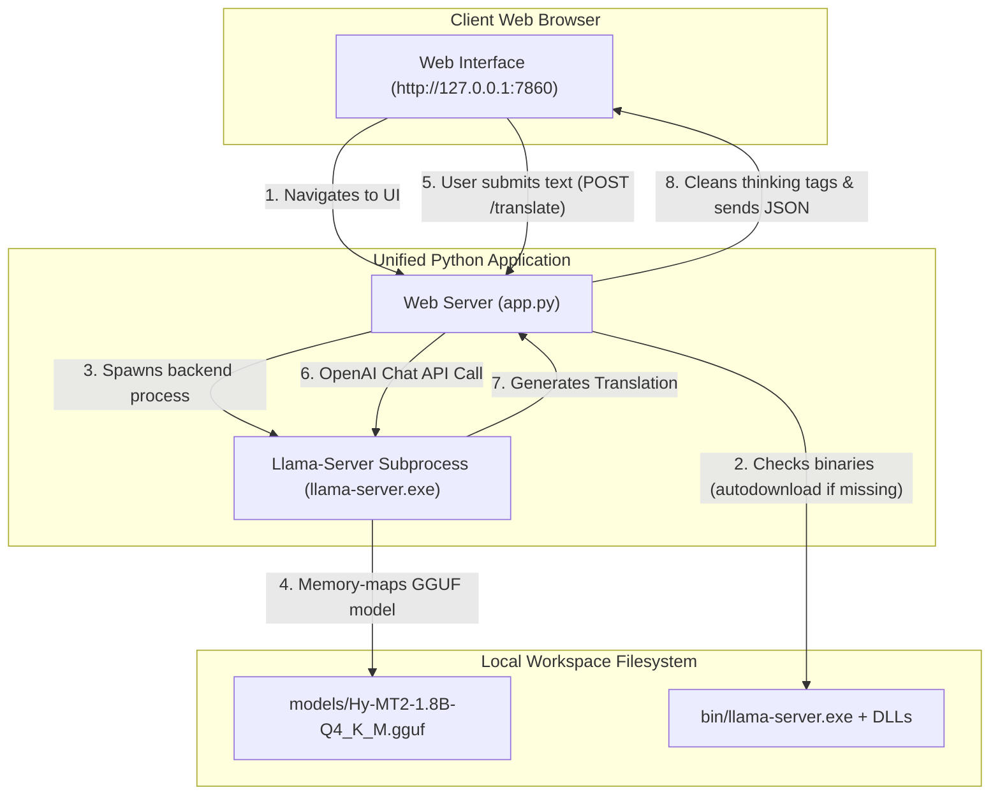

# Local Chinese-English Translator (Hy-MT2)

A premium, local Chinese-to-English translation web application for Windows. It utilizes the lightweight **Hy-MT2 1.8B GGUF** model and a self-bootstrapping local **llama-server** inference backend to run entirely offline on your CPU with zero dependencies on PyTorch, Transformers, or CUDA.

---

## How It Works

Here is a system operation flow and component interaction sequence showing how the app works:



### Component Breakdown
1. **Frontend UI (`index.html`)**: A dark/light-themed responsive page featuring character counters, real-time backend health queries to `/health`, status logs, and smooth CSS transitions.
2. **Application Server (`app.py`)**: A standard library HTTP server that:
   - Downloads and extracts `llama-server.exe` and its dependencies automatically on the first run.
   - Spawns the Llama backend as a subprocess mapped to `models/`.
   - Manages subprocess lifecycle cleanly (using `atexit` handlers).
   - Sanitizes raw LLM output (removes `<think>...</think>` tags and prompt remnants).
3. **Llama-Server (`bin/llama-server.exe`)**: The high-performance C++ backend from `llama.cpp` serving an OpenAI-compatible completion API.
4. **Model (`models/*.gguf`)**: The translation-focused model file, such as the pre-installed `Hy-MT2-1.8B-Q4_K_M.gguf`.

---

## Step-by-Step Installation & Run Guide

### Prerequisites
- **Windows OS** (Intel/AMD CPU)
- **Python 3.8+** (Must be in your environment variables/PATH)
- **Git** (optional, for pulling/cloning)

### 1. Set Up the Project Files
Ensure your project directory matches the following structure:
```text
Hy-MT2-translator/
├── models/
│   └── Hy-MT2-1.8B-Q4_K_M.gguf   <-- Put your GGUF model here
├── tests/
│   └── test_app.py
├── app.py
├── index.html
└── .gitignore
```
*Note: The `models/` and `bin/` directories are git-ignored, so local binaries and large model files will not be pushed to GitHub.*

### 2. Launch the Application
Open your terminal (PowerShell or Command Prompt) in the project root directory and run:
```powershell
python app.py
```
On the **very first run**:
- The application will notice that `llama-server.exe` is missing.
- It will automatically download the official precompiled Windows CPU-x64 binary release from `ggml-org/llama.cpp`.
- It will extract it and all required DLLs into a local `bin/` directory and clean up the downloaded archive.
- The web server will start listening at `http://127.0.0.1:7860`.

### 3. Translate Text
1. Open your web browser and navigate to **`http://127.0.0.1:7860`**.
2. Type or paste your Chinese text in the left panel.
3. Click the **Go** button (arrow icon).
4. The first request will take a few seconds to warm up the model and load it into RAM. Subsequent requests will translate near-instantly!

---

## Command Line Configuration Options

You can customize the server ports, thread counts, and context sizes by passing arguments to `python app.py`:

| Parameter | Default | Description |
| :--- | :--- | :--- |
| `--host` | `127.0.0.1` | The host address for the web server interface |
| `--port` | `7860` | The port for the web server interface |
| `--llama-host` | `127.0.0.1` | The host address for the internal `llama-server` API |
| `--llama-port` | `8081` | The port for the internal `llama-server` API |
| `--threads` | `CPU - 1` | Number of CPU threads to allocate for model generation |
| `--context` | `1024` | Context token window for the GGUF model |
| `--max-tokens` | `192` | Limit for the length of translated output |
| `--model` | *Auto-detects* | Specifies a different `.gguf` file name inside `models/` |

### Example: Running with custom speed settings
To run on port `8000` with 4 CPU threads and a smaller response generation limit for faster speed:
```powershell
python app.py --port 8000 --threads 4 --max-tokens 96
```

---

## Speed & Performance Tuning

- **Thread Allocation**: By default, the app uses one less than your total CPU cores (`CPU - 1`) capped at `6` for optimum performance without freezing your machine. If your system feels sluggish during translation, lower the threads count using `--threads 4`.
- **First Request Delay**: The GGUF model is loaded into RAM during the first translation request. Because it uses Windows memory-mapping (`mmap`), subsequent runs will be immediate.
- **Port Conflicts**: If port `7860` or `8081` is occupied on your machine, specify alternative ports using `--port <number>` or `--llama-port <number>`.
